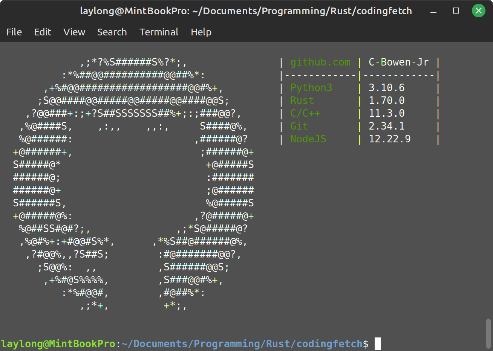

# codingfetch

Codingfetch is a neofetch like Rust program. It's inspired as an alternative to [langfetch](https://github.com/aderpas/langfetch). This will display what languages you have install and their versions. In progress is what default language logo get's populated, however a config setting will allow you to change to a prefered.

## Preview


## Install

 - TODO

## Usage

Call through command line by typing:
```
codingfetch
```

Set the github username line by adding the gh-user arguement followed by just your username. Ie
```
codingfetch --gh-user C-Bowen-Jr
```

If used through cargo run, keep in mind that to pass arguments to the project instead of to cargo, use a blank arg first.
```
cargo run -- --gh-user You
```

## Configuration File

The configuration file is created by the crate confy. The current save path is determined by confy itself, and will be dependent on your OS.

## Currently Checks

- C/C++
 - gcc
- Git
- GoLang
- Java
- Javascript
 - NodeJS
- Lua
- Perl
- Python
 - python
 - python3
- Ruby
- Rust